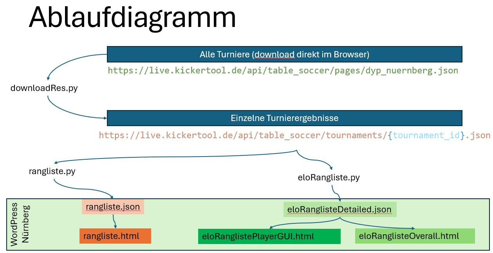

<h1>Targets</h1>

<h2>DYP Ranking</h2>
By Results Per Year: Current calculation ∑(Number of Participants)/Placement
 
<h2>Elo Ranking</h2>
Elo Ranking: Elo ranking with a display of all players 

<h2>Elo Progress</h2>
Elo Progress: Here, the player can view their Elo progress

<h1>workflow</h1>

